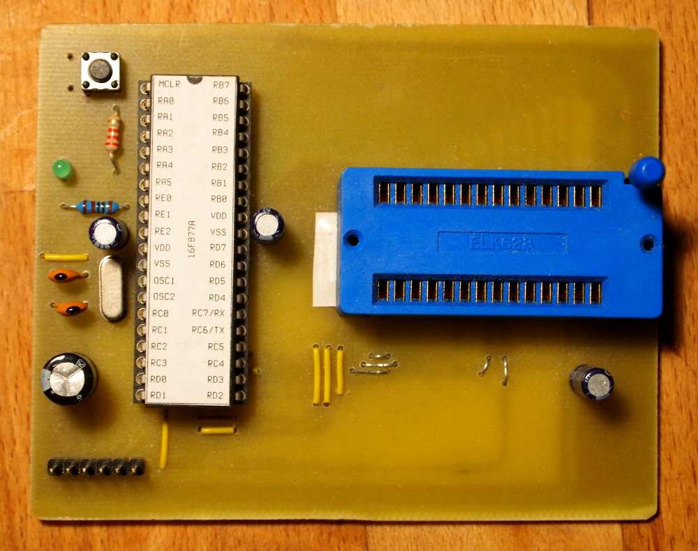

### Simple eeprom programmer

Simple programmer slapped together to write to 28Cxxx eeproms for a Z80 project.

Still needs improvements, mainly support for software write protect as mentioned in the 28Cxxx datasheet.

